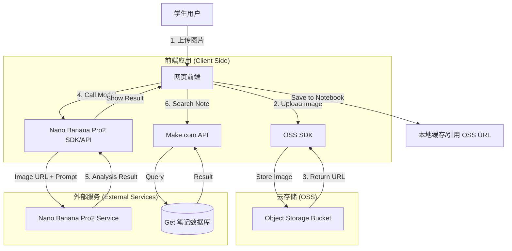
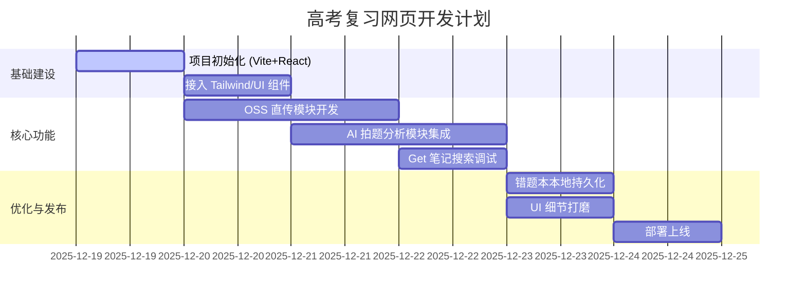

# Gemini 高考复习网页 - 技术方案文档

## 1. 项目概述 (Project Overview)

本项目旨在开发一个专为中国高三学生（特别是基础较弱的学生）设计的高考复习网页应用。系统覆盖语文、数学、英语、物理、化学、政治 6 个学科，并以**物、化、数**为核心突破点，帮助学生在短期内提升成绩。

核心特色结合了 **Get 笔记数据库** 的丰富资源与 **AI 智能问答** 能力，支持拍照搜题和知识点检索，提供专业、通俗的解题指导。

### 1.1 目标用户
- **主要群体**：高三学生（Grade 12）。
- **用户特征**：基础相对薄弱，急需短期提分，需要通俗易懂的讲解和技巧。

### 1.2 核心价值
- **降低门槛**：AI 老师 24 小时在线，随时解答疑惑。
- **精准复习**：结合 Get 笔记数据库，精准定位考点。
- **视觉交互**：拍照即提问，体验流畅。

---

## 2. 需求分析 (Requirements Analysis)

### 2.1 学科覆盖
| 学科 | 优先级 | 备注 |
| :--- | :--- | :--- |
| **数学 (Math)** | ⭐⭐⭐⭐⭐ (高) | 核心提分科目 |
| **物理 (Physics)** | ⭐⭐⭐⭐⭐ (高) | 核心提分科目，难点突破 |
| **化学 (Chemistry)** | ⭐⭐⭐⭐⭐ (高) | 核心提分科目，知识点繁多 |
| 英语 (English) | ⭐⭐⭐ | 辅助复习 |
| 语文 (Chinese) | ⭐⭐⭐ | 辅助复习 |
| 政治 (Politics) | ⭐⭐⭐ | 辅助复习 |

### 2.2 功能需求

| 模块 | 功能点 | 详细描述 | 技术关键点 |
| :--- | :--- | :--- | :--- |
| **AI 拍题分析** | 图片上传/拍摄 | 学生上传题目图片 | `input type="file"`, Camera API |
| | **Nano Banana Pro2 分析** | 使用指定模型分析图片，识别题目 | **集成 Nano Banana Pro2 模型** |
| | 智能解答 | 输出分步骤解析、核心概念解释、**秒杀技巧** | Markdown 渲染 |
| **Get 笔记搜索** | 关键词搜索 | 输入“三角函数”等关键词获取笔记 | Make.com Webhook API |
| | 知识点关联 | 显示相关 Topic ID 的笔记内容 | API JSON 解析 |
| | 深度思考 (DeepSeek) | 启用 `deep_seek: true` 获取深度解析 | API 参数配置 |
| **错题本** | 自动/手动收录 | 将 AI 分析结果保存到本地 | LocalStorage / IndexedDB |
| | 复习回顾 | 查看历史错题与解析 | 列表渲染 |

---

## 3. 技术架构 (Technical Architecture)

### 3.1 技术栈 (Tech Stack)

| 层级 | 技术选型 | 说明 |
| :--- | :--- | :--- |
| **Frontend** | **React** + **Vite** | 高性能构建，组件化开发 |
| **UI Framework** | **Tailwind CSS** | 快速构建现代化、响应式界面 |
| **Icons** | **Lucide React** | 统一美观的图标库 |
| **API Integration** | **Make.com Webhook** | 连接 Get 笔记数据库与 AI 服务 |
| **AI Model** | **Nano Banana Pro2** | 图像分析与多模态处理 (需确认接口) |
| **Deployment** | Static Hosting (Vercel/Netlify) | 静态页面部署 |

### 3.2 数据流向图 (Data Flow) - 优化版

---

## 4. 接口与存储定义 (API & Storage Specification)

### 4.1 图像存储 (OSS Integration)
为解决 LocalStorage 存储 Base64 图片导致的性能与容量问题，将引入 OSS。

*   **方案**: 阿里云 OSS (Aliyun OSS) 或 腾讯云 COS (考虑到国内访问速度)。
*   **流程**:
    1.  前端配置 OSS STS (临时安全令牌) 或 Signed URL 策略（需后端配合或利用 Serverless Function 生成签名，若纯静态前端，建议使用临时 Token 方案）。
    2.  图片上传成功后获取公网访问 URL。
    3.  将 URL 传递给 AI 模型进行分析，仅保存 URL 到错题本。

### 4.2 AI 模型调用 (Nano Banana Pro2)
*   **调用方式**: 前端直接调用 (Direct Frontend Call)。
*   **模型名称**: `Nano Banana Pro2` (假设为可用模型 ID)。
*   **注意/限制**:
    *   **API Key 安全**: 前端直接调用需注意 Key 暴露风险。建议通过环境变量注入，并设置 Referer 限制或使用 Token 转发。
    *   **并发/配额**: 前端直接发起请求，需处理并发限制和网络抖动。

### 4.3 Get 笔记 / 问答接口
*   **Endpoint**: `https://hook.us2.make.com/628uk9k37rq9v8cffmsw4u2ao7kel6l2` (保持不变)

---

## 5. 界面原型 (UI Prototype)

*(保持原有设计，增加“图片上传中...”状态提示)*

---

## 6. 优化与待讨论事项 (Optimization Discussion)

### 6.1 已采纳优化方案
1.  **OSS 接入**: 
    *   **现状**: 原方案使用 Base64 存 LocalStorage，易卡顿且易丢失。
    *   **新方案**: 接入 OSS，错题本仅存图片 URL，轻量高效。
    *   **技术点**: 需选择具体 OSS 厂商（推荐阿里云 OSS），并配置跨域流程。
2.  **前端直连 AI**:
    *   为了减少中间层延迟，确认由前端直接调用 Nano Banana Pro2。需做好错误处理（如网络波动）。

### 6.2 深度优化：OSS 浏览器直传方案 (Browser Direct Upload)

针对纯前端架构，采用 **Aliyun OSS Browser.js SDK** 进行直传是可行的，需严格控制安全与性能。

#### 6.2.1 鉴权与安全 (Security & Auth)

| 安全层级 | 方案 | 说明 | 状态 |
| :--- | :--- | :--- | :--- |
| **鉴权** | **STS Token** | 前端请求 Serverless 接口获取临时 Token (有效期 15min) | ✅ **推荐** |
| **传输** | **HTTPS** | 全程加密传输，防止中间人攻击 | ✅ **确认** |
| **ACL** | **Public Read** | 允许 AI 和前端读取图片 URL | ✅ **确认** |
| **ACL** | **Write Protected** | 仅允许持有有效 STS Token 的客户端上传 | ✅ **确认** |

#### 6.2.2 性能与成本控制 (Performance & Cost)

| 优化项 | 策略 | 目标 |
| :--- | :--- | :--- |
| **前端压缩** | `compressorjs` | 图片压缩至 **<500KB**，加速上传与 AI 分析 |
| **生命周期** | **Lifecycle Rule** | 上传 **30天** 后自动转冷存储 (Cold Storage) 或删除 |
| **隐私** | **非敏感** | 确认为公开试题，无隐私合规风险 |

#### 6.2.3 必须解决的配置问题
1.  **CORS (跨域设置)**：
    *   必须在 OSS 控制台设置允许来源 (Allowed Origins) 为你的网站域名。
    *   允许 Method: `PUT`, `POST`。

---

## 7. 最终决策汇总 (Final Decisions Summary)

| 决策点 | 最终方案 | 备注 |
| :--- | :--- | :--- |
| **架构模式** | **Client-Side First** | React 直接调用 OSS 和 AI API，轻量高效 |
| **图片存储** | **OSS Browser Direct** | 解决 LocalStorage 容量瓶颈，配合 Frontend Compression |
| **AI 模型** | **Nano Banana Pro2** | 前端直连调用，需注意 Key 保护 |
| **数据源** | **Get 笔记 + Make.com** | 利用现有 Webhook 获取高质量笔记 |
| **部署** | **Static Hosting** | Vercel / Netlify 等静态托管平台 |

---

## 8. 实施路线图 (Implementation Roadmap)

---

**文档版本**: v1.0
**日期**: 2025-12-19
